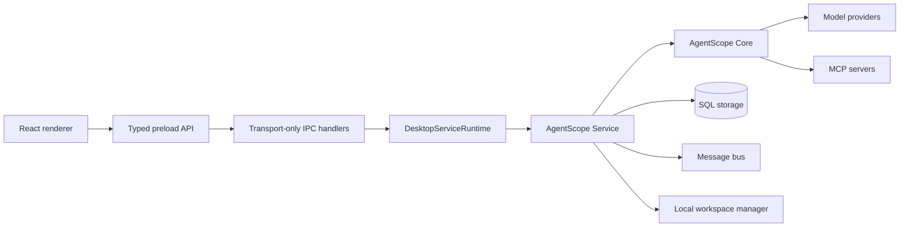

## Overview

AgentScope Desktop is an Electron client over the same Core and Service packages exposed to server applications. The main process owns one `DesktopServiceRuntime`; IPC handlers are transport adapters and do not implement a second agent, scheduler, MCP, or skill engine.

## Runtime boundary

The shared Service runtime owns:

- credentials, agent definitions, sessions, messages, and model selection;
- chat execution, event streaming, cancellation, and HITL continuation;
- schedules and execution history;
- MCP records, unified clients, and exposed MCP tools;
- skill records and synchronization into agent workspaces.

Desktop keeps only client-specific concerns in the Electron layer:

- window, tray, native dialogs, and lifecycle integration;
- typed IPC transport and renderer event delivery;
- document metadata and Markdown content edited by the local UI;
- small presentation preferences such as pinned chat sessions.

Document conversations are not a separate agent implementation. Each document and selected agent receives a stable hidden Service session. `DocumentRead`, `DocumentWrite`, and `DocumentEdit` are external-execution tools handled by the renderer, while all model, state, message, permission, workspace, and event behavior follows the common Service path.

## Persistence

The default runtime stores Service records in `~/.agentscope/service.sqlite3` and workspaces below `~/.agentscope/workspace`. Existing chat, document, MCP, skill, and skill-state JSON files are imported idempotently at startup. Legacy files are retained so migration is recoverable.

See [Desktop Service Migration](/friday/service-runtime-migration) for record mappings and validation steps.

## Dependency rules

- Renderer code accesses native capabilities only through the preload API.
- IPC handlers validate transport arguments and delegate to `DesktopServiceRuntime`.
- Desktop imports Service through its public package exports.
- Core remains usable in browser-safe entry points; Node-only persistence and adapters stay in the Service package.
- Filesystem paths use Node path APIs and are covered by the Windows, Linux, and macOS CI matrix.

<Card title="Development Guide" icon="code" href="/friday/development">
    Build and test the Desktop application
</Card>
